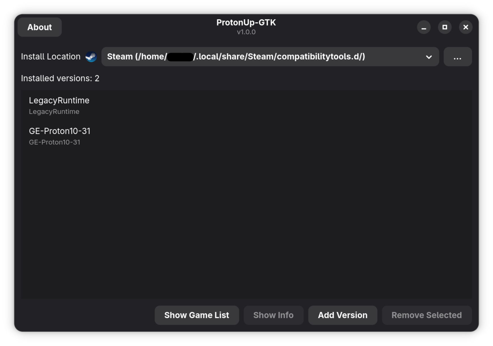

# ProtonUp-GTK
GTK4 + Libadwaita port of ProtonUp-Qt.

## Upstream Credit
This project is based on [ProtonUp-Qt](https://github.com/DavidoTek/ProtonUp-Qt) by DavidoTek.
Original ProtonUp-Qt copyright and licensing remain in place.

Install and manage [GE-Proton](https://github.com/GloriousEggroll/proton-ge-custom) and [Luxtorpeda](https://github.com/luxtorpeda-dev/luxtorpeda) for Steam and [Wine-GE](https://github.com/GloriousEggroll/wine-ge-custom) for Lutris with this graphical user interface. Based on AUNaseef's [ProtonUp](https://github.com/AUNaseef/protonup), made with Python 3 and ported to GTK4 + Libadwaita in this fork.

## Development Disclosure
This project was made with assistance from an LLM (Codex 5.3) in about 4 hours.

## Licensing
Project|License
-------|--------
ProtonUp-GTK|GPL-3.0
[ProtonUp-Qt](https://github.com/DavidoTek/ProtonUp-Qt)|GPL-3.0
[ProtonUp](https://pypi.org/project/protonup/)|GPL-3.0
[PySide6](https://pypi.org/project/PySide6/)|LGPL-3.0/GPL-2.0
[inputs](https://pypi.org/project/inputs/)|BSD
[pyxdg](https://pypi.org/project/pyxdg/)|LGPLv2
[vdf@solstice](https://github.com/solsticegamestudios/vdf/)|MIT
[steam@solstice](https://github.com/solsticegamestudios/steam/)|MIT
[requests](https://pypi.org/project/requests/)|Apache 2.0
[PyYAML](https://pypi.org/project/PyYAML/)|MIT
